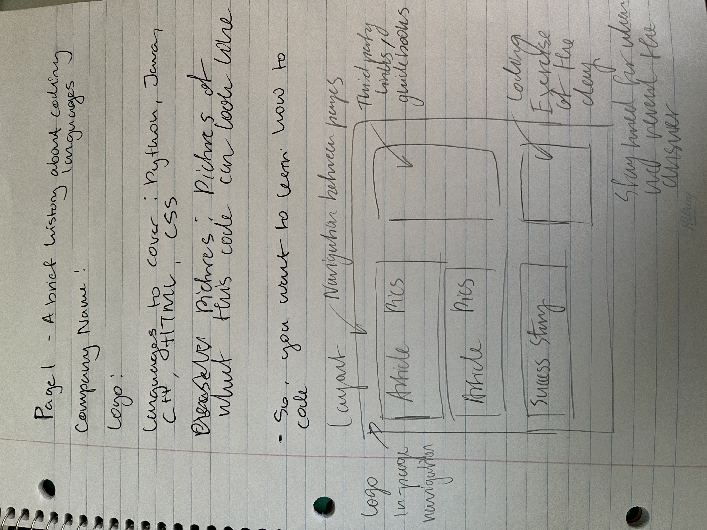
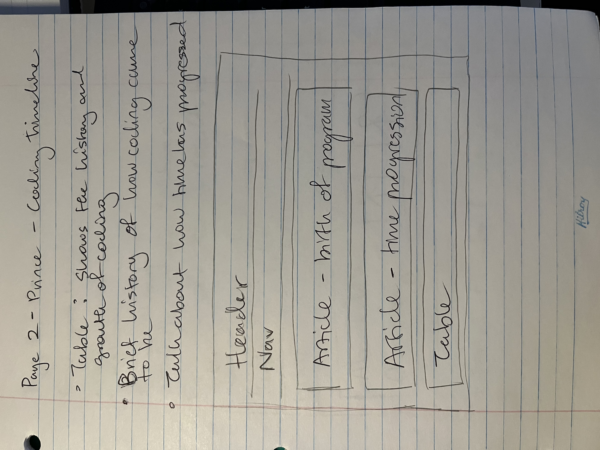
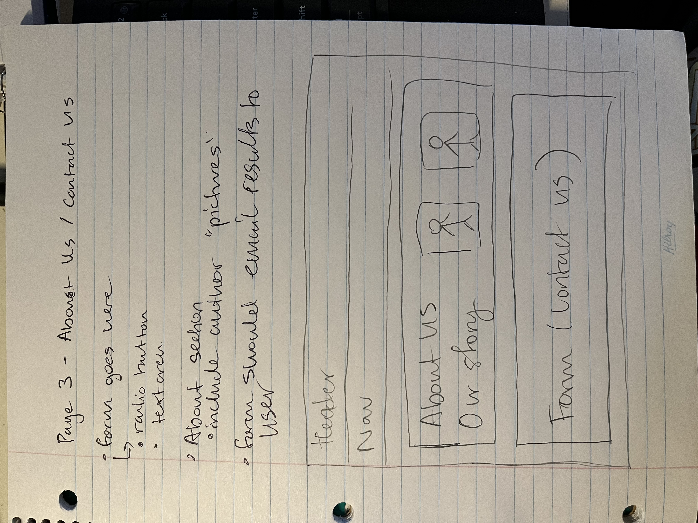

Please open me in github for the best view 

## Planning page 1 (index.html) ##

* Content included
    * misc articles about coding 
    * aside with extra information 

* Parts of the rubric included here 
    * figure and figcaption 
    * logo
    * nav menu done with list elements 
    * third party links 

## Planning page 2 (historyOfCode.html) ##

* Content to include:   
    * Table about popular coding langauages
    * Article giving a brief history of coding 
    

* Parts of the rubric covered here
    * table 
    * link to someplace on the same page 
    * attribute selector 

## Planning page 3 (contactUs.html) ##

* Content to include:
    * About us section with author pictures
    * Contact us form

* Parts of the rubric covered:
    * contact us form
    * image floated to the right of a paragraph 